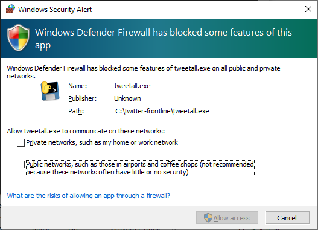

# Twitter Frontline
A few programs to automate Twitter "missions". PLease use the account to post your own stuff to prevent your account from identified as a bot.

## Usage

* [`retweet.exe`](retweet.md) - Like & Retweet [@shiroihamusan 小白鼠先生](https://twitter.com/shiroihamusan) when double clicked
    * Recommended to execute 2-3 times a day
* [`twitterhelpbot.exe`](twitterhelpbot.md) - Use Telegram web client to like & retweet the links in [@TwitterHelpBot](https://t.me/TwitterHelpBot)
    * Recommended to execute twice a day
* [`tweetall.exe`](tweetall.md) - Prepare the URL of the tweets in `tweet_list.txt`. Double clicking the executable and all tweets will be liked & retweeted.

## Note
* All executable will prompt to unblock the firewall for the first time. It is because the program and the browser is using network to communicate to each other. However, it is limited to the localhost network only, it is safe to press the Cancel button


## Problems
Occasionally, it might prompt for an Exception. It is due to Twitter will refresh in the background making the visible HTML is different from the internal representation. It will disappear when you rerun the program.
```
 Traceback (most recent call last):
  File "retweet.py", line 37, in <module>
  File "twitter.py", line 104, in get_tweets
  File "browser_extentions.py", line 10, in scroll_to_element
  File "site-packages\selenium\webdriver\remote\webdriver.py", line 634, in execute_script
  File "site-packages\selenium\webdriver\remote\webdriver.py", line 321, in execute
  File "site-packages\selenium\webdriver\remote\errorhandler.py", line 242, in check_response
selenium.common.exceptions.StaleElementReferenceException: Message: The element reference of <div class="css-1dbjc4n r-18u37iz"> is stale; either the element is no longer attached to the DOM, it is not in the current frame context, or the document has been refreshed
```