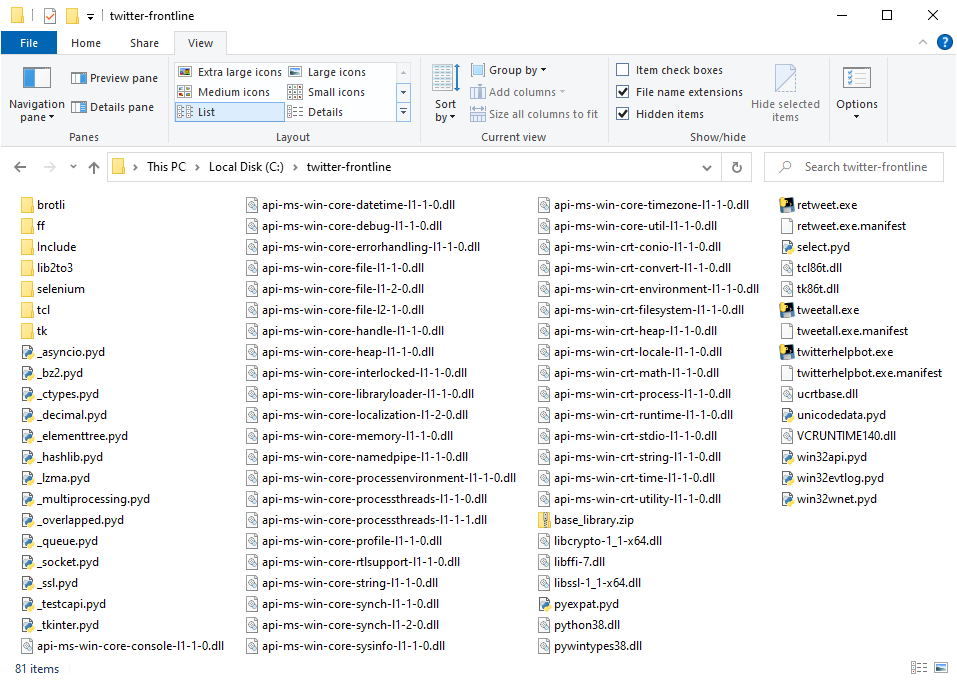
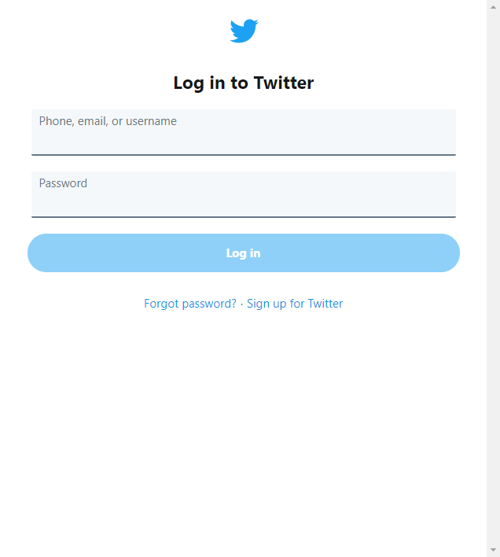
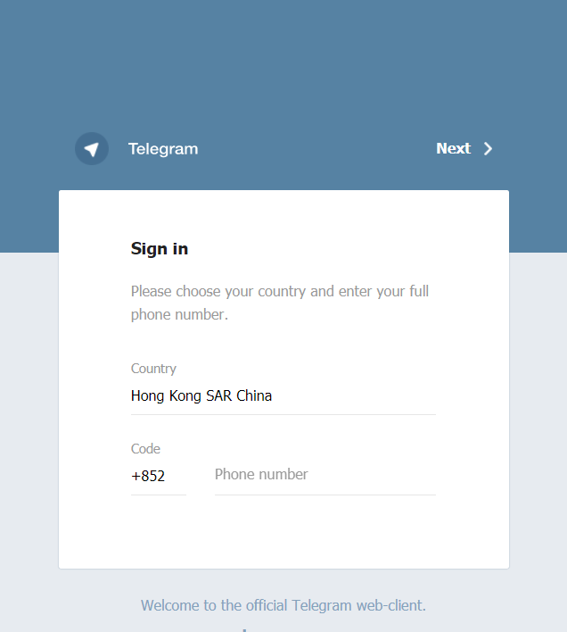

# 安裝
1. Download Twitter 戰線: <https://github.com/bbbotty/twitter-frontline/releases>
    1. 將 twitter-frontline.{VERSION}.zip 解壓到 C:\twitter-frontline
1. Download Gecko Driver: <https://github.com/mozilla/geckodriver/releases>
    * `twitter-frontline.{VERSION}+geckodriver.ZIP` 已經包咗
    1. 將 geckodriver-v0.27.0-win64.zip 解壓到 C:\twitter-frontline
1. Download FireFox Portable: <https://portableapps.com/apps/internet/firefox_portable>
    * `twitter-frontline.{VERSION}+firefox+geckodriver.ZIP` 已經包咗
    1. 裝 FireFox Portable 到 C:\twitter-frontline\ff
1. 完成圖

1. 用 FireFox Portable (`C:\twitter-frontline\ff\FirefoxPortable.exe`) Login Twitter <https://www.twitter.com/login>

1. 用 FireFox Portable Login Telegram web client <https://web.telegram.org/>

