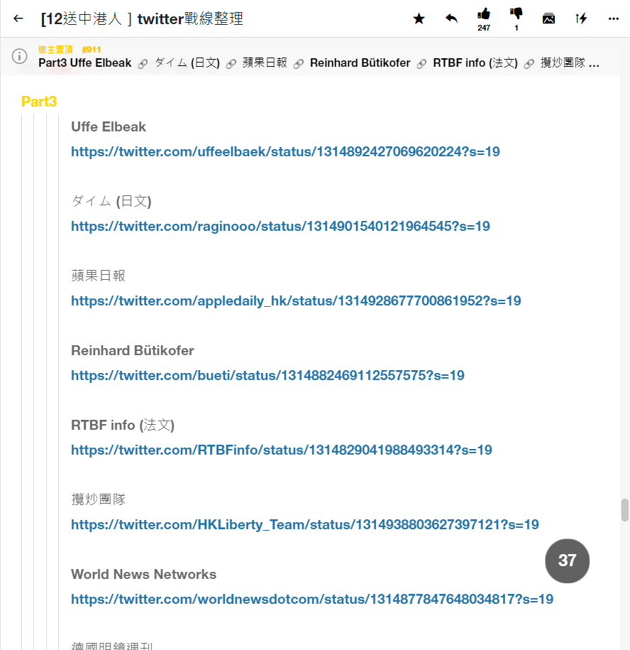

# tweetall.exe

## Description
Like & Retweet all tweets in a file or a web page

### Note
It does not login to Twitter. Please use Firefox login once first.

## Usage
```
tweetall.exe [-h] [--headless] [--delete_file] [--history] [url_or_file]
```
| Parameter         | Description    | Default                       |
|-------------|-----------------------------------|--------|
| --headless | No UI |     |
| --delete_file | Delete `url_or_file` after retweet |     |
| --history | Save the retweet URLs to prevent revisiting. Use "" if no history desired | history.json |
| url_or_file | File or web page listed the tweets | tweet_list.txt |

>

## Example
* Like & retweet all tweets listed in a LIHKG page 
    * `tweetall https://lihkg.com/thread/2196214/page/37`
